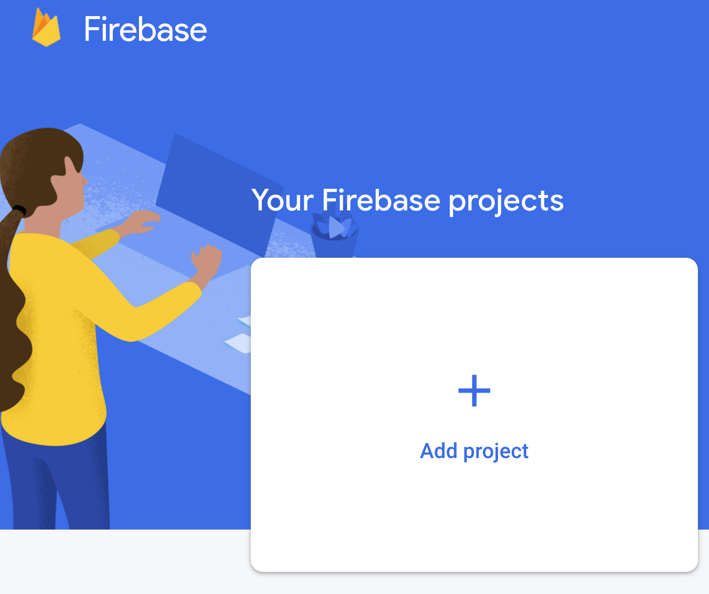
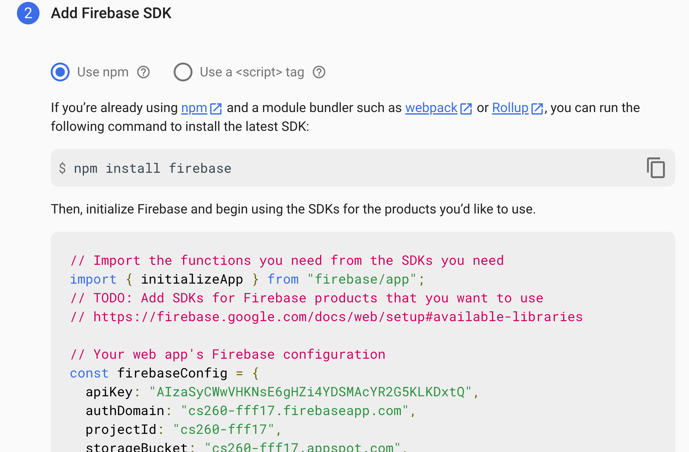
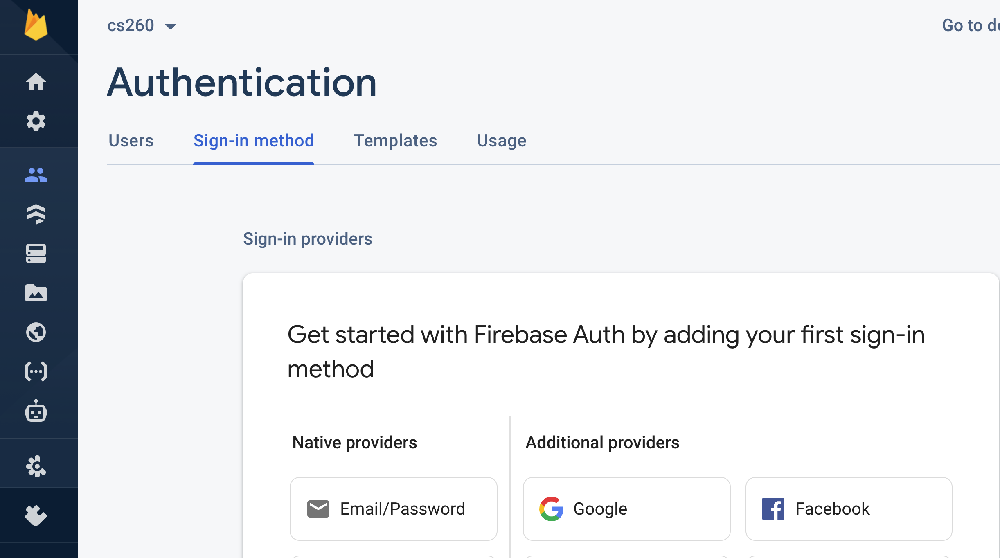
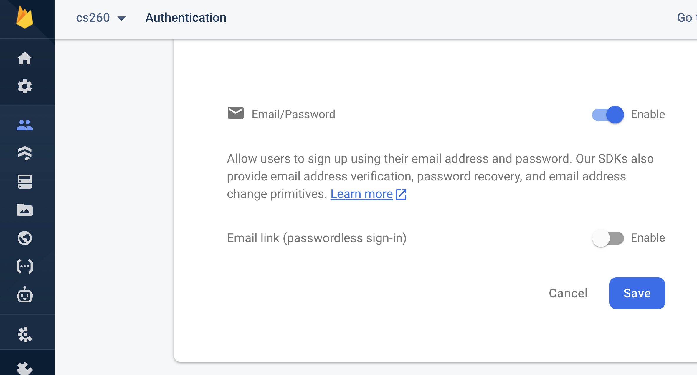
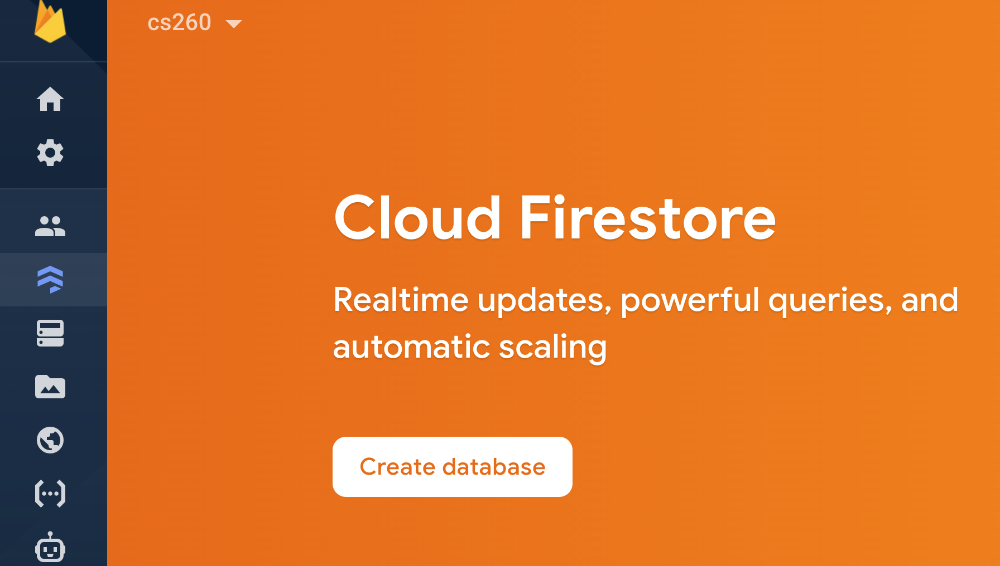
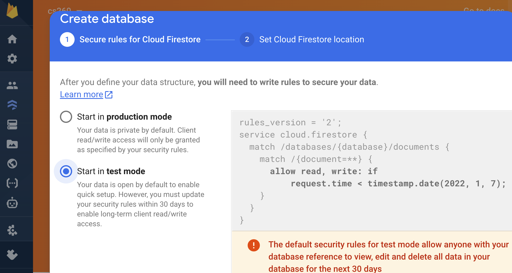
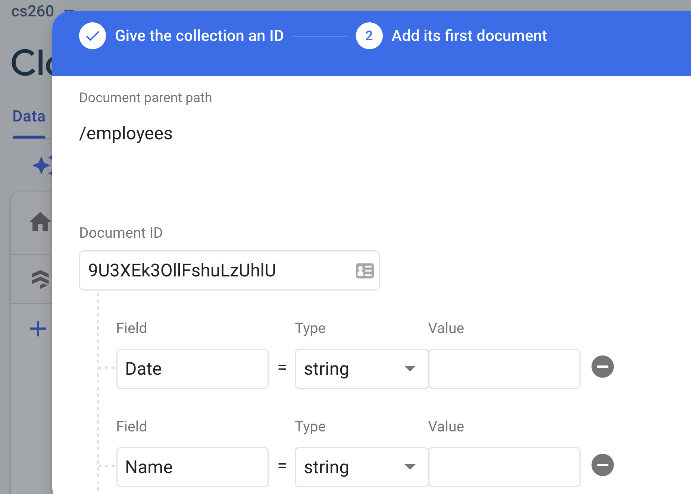
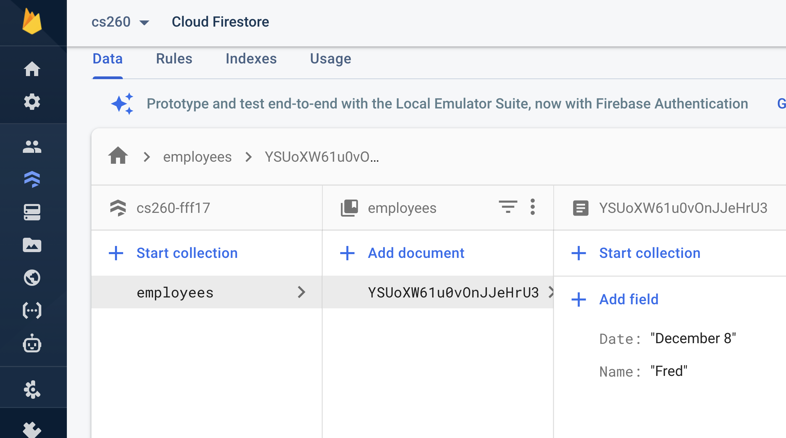

# firebase
This tutorial is intended to give you some basic information about how to use firebase authentication and the firestore database.
## Introduction
Firebase is a backend-as-a-service (BaaS) offering by Google that features databases, an ML kit, cloud functions, authentication, hosting, cloud storage, and more. Firebase abstracts the complexity of building a robust and scalable backend system, enabling developers to focus on building the client side of applications.
## Firebase Setup

* Visit the Firebase console and sign in with your Google account
* Click “Add Project”
* Click “Continue” to create the project (we don’t need analytics)



* Click on the web icon </>
* For the app nickname, enter whatever name you want and click “Next”
* When your Firebase configuration is displayed, copy the contents within the scripts tag



* On the Console, select authentication and select 'email/password'



* Notice that you could also choose to authenticate with Google or Facebook.
* Enable email/password and save



* Now create a database



* And start the database in test mode



* And create a collection with "Date" and "Name"



* And add a document



* Now create a vue project with

```
vue create firebase
```

* And use npm to install firebase

```
npm install firebase --save
```
* Then create a vue.config file with the following contents if you are working on your droplet.  You should be able to see the default vue application.
```
module.exports = {
  devServer: {
    disableHostCheck: true
  }
}
```
* Now, modify src/App.vue to have the following, but replace the firebase config with your values
```
<template>
    <div id="app">
        <div id="nav">
            <router-link to="/">Home</router-link> |
            <router-link to="/register">Register</router-link> |
            <button @click="logout">Logout</button>
        </div>
        <router-view />
    </div>
</template>

<script>
const firebaseConfig = {
  apiKey: "***",
  authDomain: "***",
  projectId: "***",
  storageBucket: "***",
  messagingSenderId: "***",
  appId: "***",
  measurementId: "***"
};
// Initialize Firebase
import { initializeApp } from "firebase/app";
let firebase = initializeApp(firebaseConfig);
import {getAuth, signOut} from 'firebase/auth';
const auth = getAuth();

export default {
    data() {
        return {
          firebase: firebase,
        }
    },
    methods: {
        logout() {
                signOut(auth)
                .then(() => {
                    alert('Successfully logged out');
                    this.$router.push('/');
                })
                .catch(error => {
                    alert(error.message);
                    this.$router.push('/');
                });
        },
    },
};
</script>
<style>
#app {
    font-family: Avenir, Helvetica, Arial, sans-serif;
    -webkit-font-smoothing: antialiased;
    -moz-osx-font-smoothing: grayscale;
    text-align: center;
    color: #2c3e50;
}

#nav {
    padding: 30px;
}

#nav a {
    font-weight: bold;
    color: #2c3e50;
}

#nav a.router-link-exact-active {
    color: #42b983;
}

input {
    margin-right: 20px;
}
</style>
```
* Modify src/router/index.js to have the following routes
```
import Vue from 'vue'
import VueRouter from 'vue-router'
import Home from '../views/Home.vue'

Vue.use(VueRouter)

const routes = [
    {
        path: '/',
        name: 'Home',
        component: Home,
    },
    {
        path: '/register',
        name: 'Register',
        component: () =>
            import(/* webpackChunkName: "about" */ '../views/About.vue'),
    },
    {
        path: '/dashboard',
        name: 'Dashboard',
        component: () =>
            import(/* webpackChunkName: "dashboard" */ '../views/Dashboard.vue'),
        meta: {
          authRequired: true,
        },
    },
];
const router = new VueRouter({
  mode: 'history',
  base: process.env.BASE_URL,
  routes
})
    
export default router
```
* Create the Dashboard view in src/views/Dashboard.vue

```
<template>
    <div>
        <h2>Dashboard</h2>
        <p>This page is only visible to users that are currently logged in</p>
        <ul>
            <li v-for="employee in employees" :key="employee.Name">
                {{ employee.Name }} {{ employee.Date}}
            </li>
        </ul>
    </div>
</template>

<script>
import {getFirestore, collection, getDocs } from "firebase/firestore"; 
const db = getFirestore();
export default {
    name: 'Dashboard',
    data() {
        return {
            employees: []
        }
    },
    methods: {
      async getall() {
          const querySnapshot = await getDocs(collection(db, "employees"));
          querySnapshot.forEach((doc) => {
            console.log(`${doc.id} => ${doc.data()}`);
            console.log(doc.data());
            this.employees.push(doc.data());
          });
      }
    },
    created: function() {
      this.getall()
    },
};
</script>

<style lang="scss" scoped></style>
```
* And modify the src/views/About.vue to have the following content

```
<template> 
    <div>
        <form @submit.prevent="register">
            <h2>Register</h2>
            <input
                type="email"
                placeholder="Email address..."
                v-model="email"
            />
            <input
                type="password"
                placeholder="password..."
                v-model="password"
            />
            <button type="submit">Register</button>
        </form>
    </div>  
</template>
<script>
import { getAuth, createUserWithEmailAndPassword} from 'firebase/auth';
const auth = getAuth();
export default {
    name: 'Register',
    data() {
        return {
            email: '',
            password: '',
        };
    },
    methods: { 
        register() {
                createUserWithEmailAndPassword(auth, this.email, this.password)
                .then(() => {
                    alert('Successfully registered! Please login.');
                    this.$router.push('/');
                })
                .catch(error => {
                    alert(error.message);
                });
        },
    },
};
</script>
```
* And modify the src/views/Home.vue to have the following

```
<template>
    <div>
        <form @submit.prevent="login">
            <h2>Login</h2>
            <input
                type="email"
                placeholder="Email address..."
                v-model="email"
            />
            <input
                type="password"
                placeholder="password..."
                v-model="password"
            />
            <button type="submit">Login</button>
        </form>
    </div>
</template>

<script>
import { getAuth, signInWithEmailAndPassword} from 'firebase/auth';
const auth = getAuth();

export default {
    name: 'Home',
    data() {
        return {
            email: '',
            password: '',
        };
    },
    methods: {
        login() {
                signInWithEmailAndPassword(auth,this.email, this.password)
                .then(() => {
                    alert('Successfully logged in');
                    this.$router.push('/dashboard');
                })
                .catch(error => {
                    alert(error.message);
                });
        },
    },
};
</script>
```
* You should now be able to run your vue server and see the application

```
npm run serve
```
